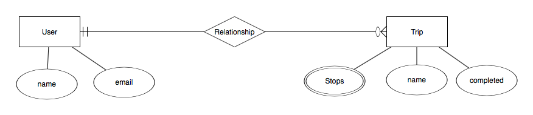

# Project - Travel App API Project Spec

## Overview

We will be building a trip planning app that stores a list of trips for a user.
The goal of this project is for you to practice everything you have learnt about building an API.

### The API

Your API should contain/use:

1. a relational database to store all our trips.(SQL, Postgres)
2. a trips resource - you should be able to create, list, show, and destroy trips.
3. completed trips are marked as completed.
4. unit tests for all routes.

### Routes and Actions

Create unit tests for and then implement the following new resources and routes:

### ***Users***

| Action  | HTTP Verb | Path             | Effect                           |
|---------|-----------|------------------|----------------------------------|
| create  | POST      | /users           | Creates a new user               |
| index   | GET       | /users           | Shows/lists all users            |
| show    | GET       | /users/<user_id> | Shows a specific user            |
| update  | PUT/PATCH | /users/<user_id> | Updates/replaces a specific user |
| destroy | DELETE    | /users/<user_id> | Deletes a specific user          |

### ***Trips***

| Action  	| HTTP Verb 	| Path             	| Effect                           	|
|---------	|-----------	|------------------	|----------------------------------	|
| create  	| POST      	| /trips           	| Creates a new trip               	|
| index   	| GET       	| /trips           	| Shows/lists all trips            	|
| show    	| GET       	| /trips/<trip_id> 	| Shows a specific trip            	|
| update  	| PUT/PATCH 	| /trips/<trip_id> 	| Updates/replaces a specific trip 	|
| destroy 	| DELETE    	| /trips/<trip_id> 	| Deletes a specific trip          	|

### Relationships

